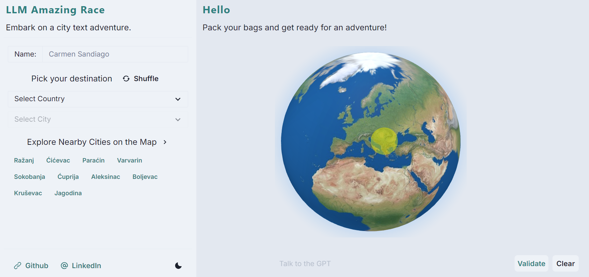

# 🌍 LLM-Based Text Adventure: Amazing Race (UI)

Welcome to the **LLM-Based Text Adventure: Amazing Race** project! This is an interactive, location-based text adventure game inspired by "The Amazing Race." The game challenges players to solve riddles and navigate through various cities and points of interest, using an AI-powered system to deliver a unique and engaging experience.

**NOTE**: This repository only holds the frontend UI code for this project.

### Complementary Repository: https://github.com/astronights/llm-amazing-race-ai

## 🎯 Project Overview

The game is built with a modern tech stack combining TypeScript, Next.js and React, leveraging the power of large language models (LLMs) to create dynamic and immersive gameplay. Players will embark on a virtual adventure where they must solve riddles to discover and travel to various landmarks around the world.
## 🛠️ Tech Stack

### **Frontend:**
- **TypeScript & Next.js**: The frontend is built with Next.js, a powerful React framework, combined with TypeScript for robust type safety and scalability. Deployed seamlessly on Vercel for fast and efficient deployment.
- **Three.js**: Utilized for rendering the interactive globe component, enabling intuitive location selection.
- **Chakra UI**: Provides a set of minimal and customizable components, enhancing the UI with consistent theming and design.
- **Vercel**: Used for deployment, ensuring reliable and high-performance hosting.

### **Data:**
- **Open Source Location Data**: Leveraging open source datasets to provide accurate and detailed information on cities and points of interest, which is crucial for creating engaging and realistic challenges based on real-world locations.

## 🌟 Features

- **Interactive Riddles**: Solve AI-generated riddles to unlock and identify your next destination, making each interaction engaging and challenging.
- **Dynamic Gameplay**: Enjoy a unique experience every time you play, with the LLM generating varied riddles and routes based on your progress.
- **Global Exploration**: Explore a wide range of cities and points of interest from around the globe, testing your knowledge and problem-solving skills.
- **Real-Time Feedback**: Receive instant feedback on your answers, guiding you toward the next destination and enhancing the interactive experience.

## 🚀 Getting Started

### **Prerequisites**

Before you begin, ensure you have the following installed:

- **Node.js** (for running the Next.js frontend)
- **Vercel CLI** (for deployment)
- **Git** (for version control)

### **Installation**

1. **Clone the Repository:**

   ```bash
   git clone https://github.com/astronights/llm-amazing-race-ui.git
   cd llm-amazing-race-ui
   ```

2. **Setup NPM Environment**

   ```bash
   # Omit optional to optimize builds
   npm install --omit=optional
   ```

3. **Run APp**

   ```bash
   npm run next-dev
   ```

### Demo



### Further Enhancements

A small portion of the project for the streaming Chat UI with the puzzle is yet to be implemented.